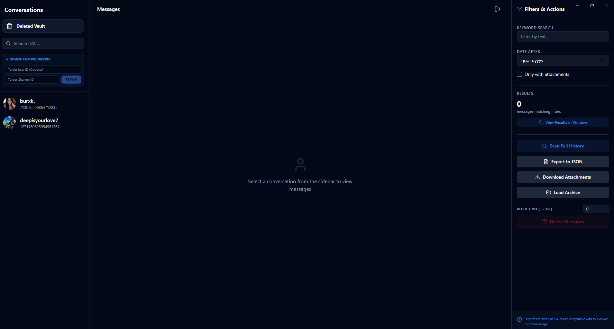
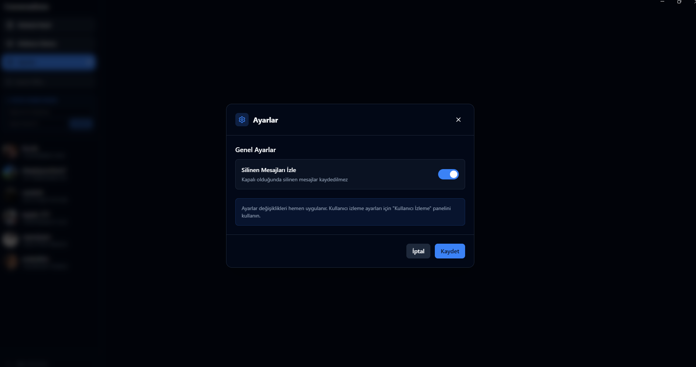
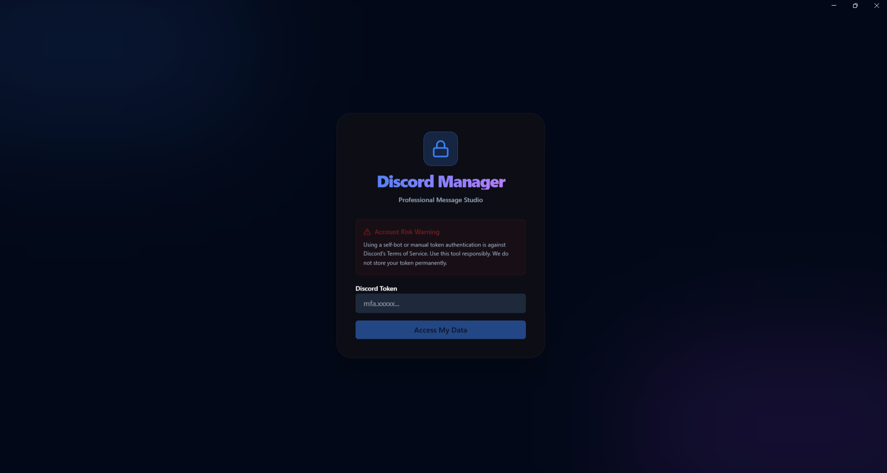
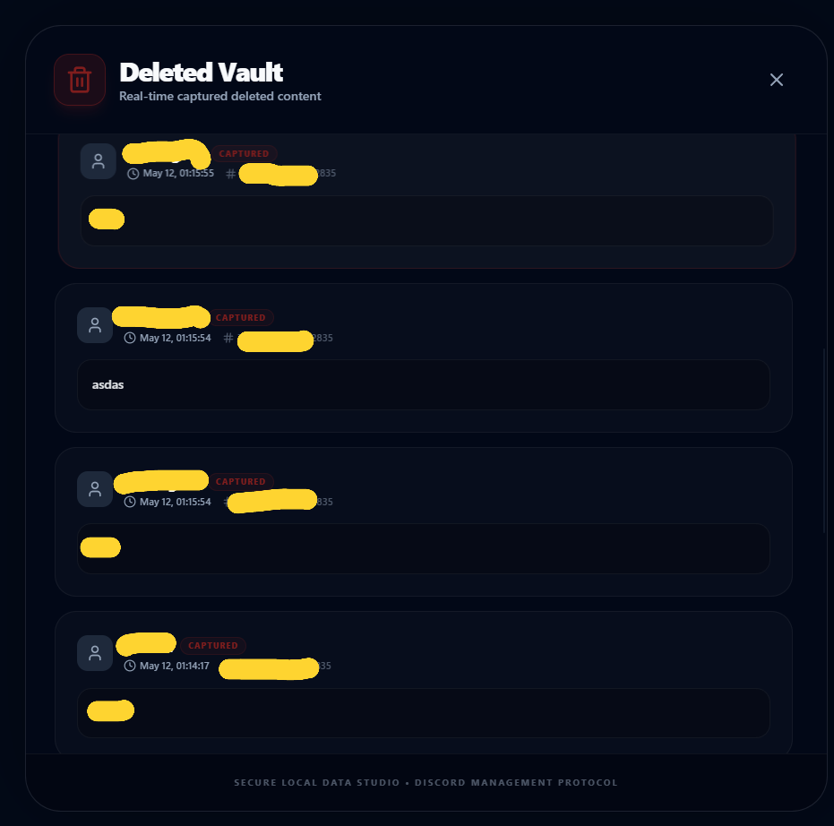
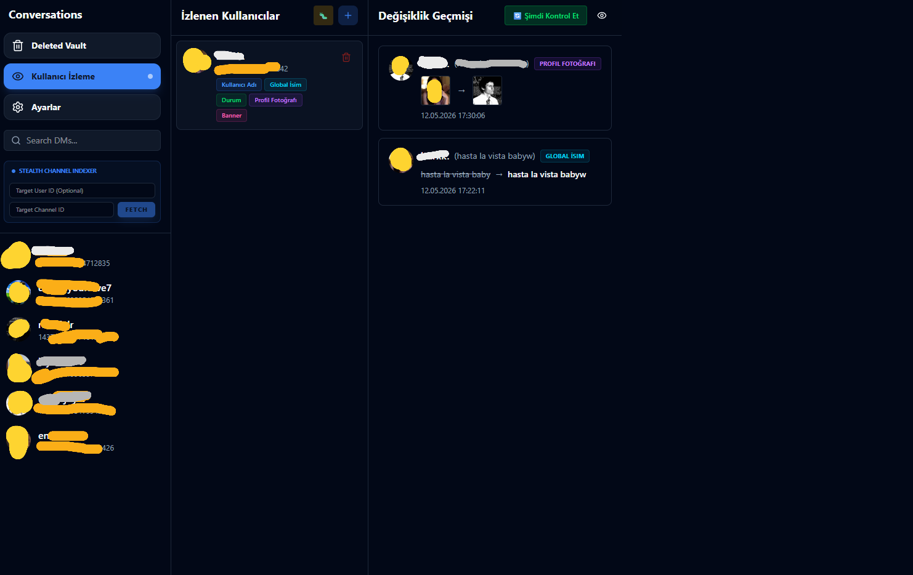

# 📊 Discord Data Studio


Discord verilerinizi analiz etmek, yedeklemek ve yönetmek için tasarlanmış, güçlü ve modern bir masaüstü uygulamasıdır.

## ✨ Özellikler

### 📨 Mesaj Yönetimi
- 🔍 **Gelişmiş Veri İndeksleme**: Tüm DM geçmişinizi ve mesaj verilerinizi hızlıca tarayın ve indeksleyin.
- 🕵️ **Dedektif Modu (Deleted Message Watcher)**: Karşı tarafın sildiği mesajları anında yakalar ve yerel kasanıza (Vault) kaydeder.
- 📸 **Medya Pusu Sistemi**: Silinen mesajlardaki resim ve videoları silinmeden önce otomatik olarak indirir ve yedekler.
- 🧹 **Güvenli Toplu Silme (Purge)**: DM'lerde sadece kendi mesajlarınızı akıllı filtreleme ile saniyeler içinde temizleyin.
- 📂 **Arşivleme ve Yedekleme**: Mesajlarınızı yerel olarak güvenli bir şekilde saklayın ve istediğiniz zaman çevrimdışı görüntüleyin.

### 👁️ Kullanıcı İzleme Sistemi
- 📝 **Username İzleme**: Kullanıcıların kullanıcı adı değişikliklerini otomatik olarak kaydedin.
- 🌐 **Global Name İzleme**: Discord görünen isim (display name) değişikliklerini takip edin.
- 🖼️ **Profil Fotoğrafı İzleme**: Avatar değişikliklerini eski ve yeni görselleriyle birlikte kaydedin.
- 🎨 **Banner İzleme**: Profil banner değişikliklerini görsel önizleme ile takip edin.
- 🟢 **Durum İzleme**: Kullanıcıların online/offline/idle/dnd durumlarını gerçek zamanlı olarak izleyin (WebSocket).
- 📊 **Timeline Görünümü**: Tüm değişiklikleri kronolojik sırayla görüntüleyin ve filtreleyin.
- 🎯 **Özelleştirilebilir İzleme**: Her kullanıcı için hangi özelliklerin izleneceğini seçin.

### ⚙️ Ayarlar ve Yapılandırma
- 🔧 **Ayarlar Paneli**: Uygulama davranışını özelleştirin.
- 🔄 **İzleme Kontrolü**: Silinen mesaj izlemeyi açıp kapatabilme.
- 💾 **Yerel Veri Saklama**: Tüm veriler güvenli bir şekilde yerel olarak saklanır.

### 🛡️ Güvenlik ve Performans
- 🛡️ **Anti-Ban Kalkanı**: Discord API limitlerine takılmamak için insan taklidi yapan (jitter) gecikmeler ve cooldown sistemi.
- ⚡ **Gerçek Zamanlı İzleme**: WebSocket bağlantısı ile anlık durum güncellemeleri.
- 🎨 **Modern Arayüz**: Karanlık mod odaklı, hızlı ve kullanıcı dostu React tabanlı arayüz.

## Dashboard Page

The main dashboard where you can view DMs, upload JSON archives, and access all features.



## User Tracking Panel

Track user changes including username, global name, avatar, banner, and online status in real-time.


## Settings Panel

Configure application behavior including deleted message tracking and other preferences.



## Login Page

The login screen where you authenticate with your Discord token.



## Deleted History Page

View messages, pictures, and videos that have been deleted by other users, with channel/server information.



## Settings Page

The main dashboard where you can view DMs, upload JSON archives, and access all features.


## User Tracker Page



## 🚀 Başlangıç

Projeyi yerel makinenizde çalıştırmak için aşağıdaki adımları izleyin.

### Gereksinimler

- [Node.js](https://nodejs.org/) (v20 veya üzeri önerilir)
- npm veya yarn

### Kurulum

1. Depoyu klonlayın:
   ```bash
   git clone https://github.com/Paradox-Forge/discord-data-studio.git
   ```
2. Proje dizinine gidin:
   ```bash
   cd discord-data-studio
   ```
3. Bağımlılıkları yükleyin:
   ```bash
   npm install
   ```

### Kullanım

Geliştirme modunda başlatmak için:

```bash
npm run dev
```

Uygulamayı paketlemek (Build) için:

```bash
npm run build:desktop
```

### Özellik Kullanımı

#### Kullanıcı İzleme
1. Uygulamaya giriş yapın
2. Sol menüden **"Kullanıcı İzleme"** seçeneğine tıklayın
3. **"+"** butonuna tıklayarak yeni kullanıcı ekleyin
4. Discord User ID'sini girin (Discord'da kullanıcıya sağ tık > ID'yi Kopyala)
5. İzlemek istediğiniz özellikleri seçin:
   - ☑️ Kullanıcı Adı
   - ☑️ Global İsim
   - ☑️ Durum (Online/Offline/Idle/DND)
   - ☑️ Profil Fotoğrafı
   - ☑️ Banner
6. **"Ekle"** butonuna tıklayın
7. Değişiklikler otomatik olarak timeline'da görünecektir

**Not:** Durum izleme için Discord Gateway bağlantısı gereklidir ve gerçek zamanlı çalışır.

#### Silinen Mesajları Görüntüleme
1. Sol menüden **"Deleted Vault"** seçeneğine tıklayın
2. Silinen tüm mesajlar, kanal/sunucu bilgileriyle birlikte görüntülenir
3. Mesajlardaki görseller ve dosyalar da kaydedilir

#### Ayarlar
1. Sol menüden **"Ayarlar"** seçeneğine tıklayın
2. **"Silinen Mesajları İzle"** toggle'ını açıp kapatabilirsiniz
3. Değişiklikler otomatik olarak kaydedilir

## 🛠️ Teknoloji Yığını

- **Framework**: [Electron](https://www.electronjs.org/)
- **Frontend**: [React](https://reactjs.org/) + [Vite](https://vitejs.dev/)
- **Styling**: [Tailwind CSS v4](https://tailwindcss.com/)
- **State Management**: [Zustand](https://github.com/pmndrs/zustand)
- **Networking**: [Axios](https://axios-http.com/) + WebSocket
- **Icons**: [Lucide React](https://lucide.dev/)
- **Date Handling**: [date-fns](https://date-fns.org/)

## 📁 Veri Depolama

Tüm veriler yerel olarak güvenli bir şekilde saklanır:

- **Windows**: `%APPDATA%\discord-data-studio\`
  - `config.json` - Uygulama ayarları ve izlenen kullanıcılar
  - `archives/` - Mesaj arşivleri ve silinen mesajlar
  - `user_tracking/` - Kullanıcı değişiklik logları
  - `logs/` - Uygulama logları

## 🎯 Özellik Detayları

### Kullanıcı İzleme Sistemi

**İzlenebilir Özellikler:**
- **Username**: Kullanıcı adı değişiklikleri (60 saniyede bir kontrol)
- **Global Name**: Discord görünen isim değişiklikleri (60 saniyede bir kontrol)
- **Avatar**: Profil fotoğrafı değişiklikleri (60 saniyede bir kontrol)
- **Banner**: Profil banner değişiklikleri (60 saniyede bir kontrol)
- **Status**: Online/Offline/Idle/DND durumu (gerçek zamanlı, WebSocket)

**Kısıtlamalar:**
- Sadece arkadaş listenizdeki veya ortak sunucudaki kullanıcıları izleyebilirsiniz
- Status izleme için Discord Gateway bağlantısı gereklidir
- Rate limiting koruması mevcuttur (60 saniye polling interval)

### Silinen Mesaj İzleme

**Özellikler:**
- Gerçek zamanlı yakalama (WebSocket)
- Kanal/Sunucu bilgisi gösterimi
- Medya dosyalarını otomatik indirme
- Timeline görünümü
- Filtreleme ve arama

**Desteklenen Kanal Türleri:**
- Direct Messages (DM)
- Group DMs
- Server Channels (Guild)

## ⚠️ Güvenlik Uyarısı

Bu uygulama Discord Kullanıcı Token'ınızı (User Token) kullanır. Bu tür araçların kullanımı Discord Hizmet Koşulları'nı (ToS) ihlal edebilir. Tüm sorumluluk kullanıcıya aittir. 

**Güvenlik Önlemleri:**
- Token'ınız yalnızca oturum süresince bellekte tutulur
- Token asla sunucularımıza gönderilmez
- Tüm veriler yerel olarak saklanır
- Anti-ban koruması mevcuttur (rate limiting, jitter delays)

**Öneriler:**
- Ana hesabınızı kullanmayın
- Alternatif bir hesap kullanın
- Sorumlu kullanın

## 🤝 Katkıda Bulunma

Katkılarınızı bekliyoruz! Lütfen [CONTRIBUTING.md](CONTRIBUTING.md) dosyasını okuyun.

## 📞 Destek

Sorunlar için [GitHub Issues](https://github.com/Paradox-Forge/discord-data-studio/issues) kullanın.

## 🙏 Teşekkürler

Bu projeyi kullandığınız için teşekkür ederiz! Yıldız ⭐ vermeyi unutmayın.

## 📄 Lisans

Bu proje **Apache License 2.0** ile lisanslanmıştır. Detaylar için [LICENSE](LICENSE) dosyasına göz atabilirsiniz.
