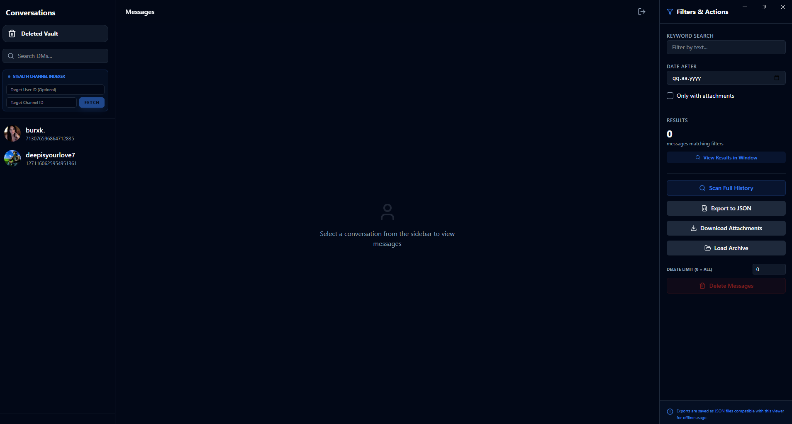
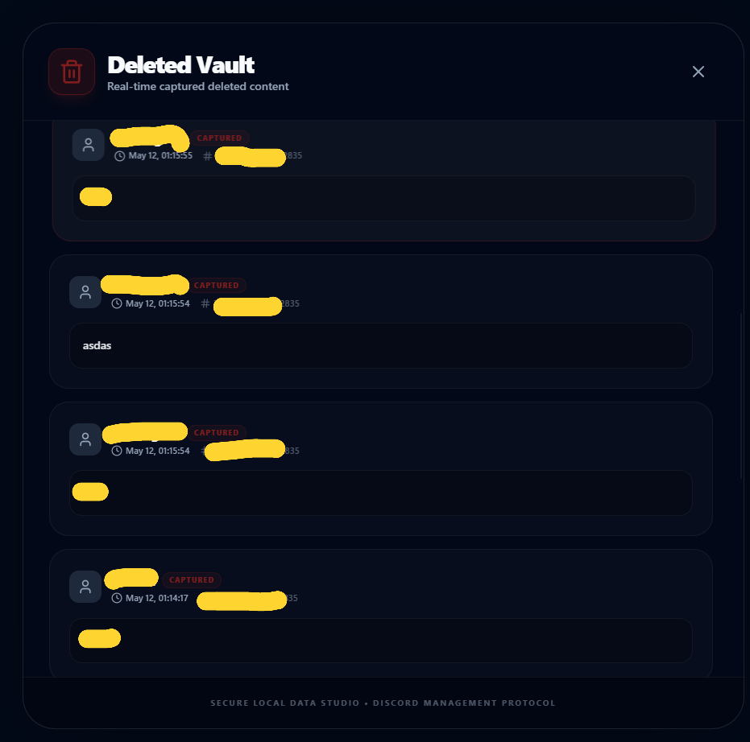
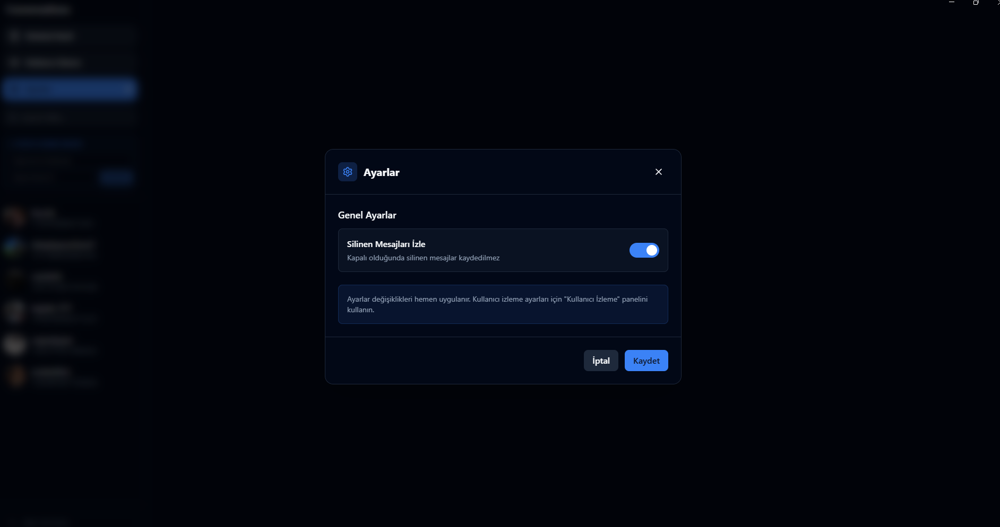
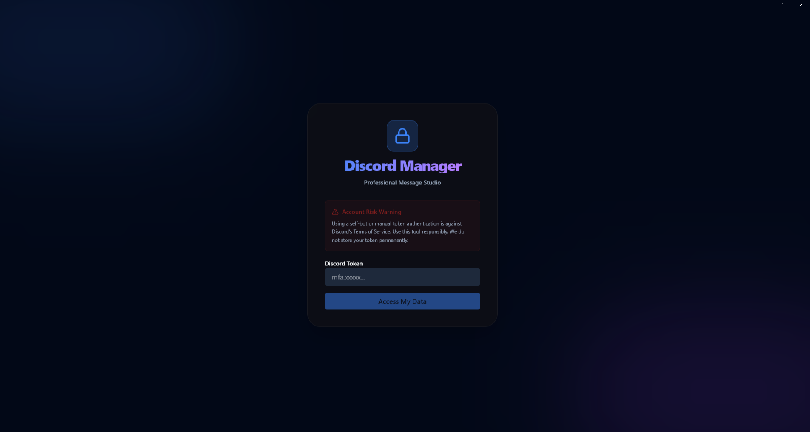

# 📊 Discord Data Studio

> **[Türkçe Döküman](#-turkish-documentation--türkçe-dokümantasyon)** | **English Documentation**


A powerful and modern desktop application designed to analyze, backup, and manage your Discord data with advanced tracking and monitoring capabilities.

## ✨ Features

### 📨 Message Management
- 🔍 **Advanced Data Indexing**: Quickly scan and index your entire DM history and message data.
- 🕵️ **Detective Mode (Deleted Message Watcher)**: Instantly captures messages deleted by others and saves them to your local Vault.
- 📸 **Media Ambush System**: Automatically downloads and backs up images and videos from deleted messages before they're gone.
- 🧹 **Safe Bulk Delete (Purge)**: Clean your own messages in DMs within seconds using smart filtering.
- 📂 **Archiving and Backup**: Safely store your messages locally and view them offline anytime.
- 🔄 **Infinite Scroll Pagination**: View deleted messages with intelligent pagination - loads 50 messages at a time for optimal performance.

### 🗑️ Advanced Deletion System
- 💪 **Fast Bulk Deletion**: Delete multiple messages quickly (350ms between deletions).
- 📊 **Real-Time Deletion Progress**: Visual modal showing exactly which message is being deleted.
- ⏱️ **Time Tracking**: See elapsed time and estimated time remaining during deletion.
- ✅ **Success/Error Statistics**: Live counters for successful and failed deletions.
- 🔄 **Smart Retry Mechanism**: Automatically retries failed deletions with rate limit handling.
- 📝 **Per-Message Status**: Each message shows its current status (pending, deleting, success, error).

### 👁️ User Tracking System
- 📝 **Username Tracking**: Automatically log user name changes.
- 🌐 **Global Name Tracking**: Track Discord display name (global name) changes.
- 🖼️ **Profile Picture Tracking**: Log avatar changes with before/after visuals.
- 🎨 **Banner Tracking**: Track profile banner changes with visual previews.
- 🟢 **Status Tracking**: Monitor users' online/offline/idle/dnd status in real-time (WebSocket).
- 📊 **Timeline View**: View all changes chronologically with filtering options.
- 🎯 **Customizable Tracking**: Choose which features to track for each user.

### ⚙️ Settings and Configuration
- 🔧 **Settings Panel**: Customize application behavior.
- 🔄 **Tracking Control**: Enable or disable deleted message tracking.
- 💾 **Local Data Storage**: All data is securely stored locally.

### 🛡️ Security and Performance
- 🛡️ **Anti-Ban Shield**: Jitter delays and cooldown system to avoid Discord API limits with human-like behavior.
- ⚡ **Real-Time Monitoring**: Instant status updates via WebSocket connection.
- 🎨 **Modern Interface**: Dark mode focused, fast and user-friendly React-based interface.
- 🚀 **Optimized Performance**: Intelligent pagination prevents loading lag with large datasets.

## 📸 Screenshots

### Dashboard Page
The main dashboard where you can view DMs, upload JSON archives, and access all features.



### User Tracking Panel
Track user changes including username, global name, avatar, banner, and online status in real-time.


### Deleted History Page
View messages, pictures, and videos that have been deleted by other users, with channel/server information. Now with pagination support for thousands of messages!



### Settings Panel
Configure application behavior including deleted message tracking and other preferences.



### Login Page
The login screen where you authenticate with your Discord token.



## 🚀 Getting Started

Follow these steps to run the project on your local machine.

### Prerequisites

- [Node.js](https://nodejs.org/) (v20 or higher recommended)
- npm or yarn

### Installation

1. Clone the repository:
   ```bash
   git clone https://github.com/Paradox-Forge/discord-data-studio.git
   ```
2. Navigate to the project directory:
   ```bash
   cd discord-data-studio
   ```
3. Install dependencies:
   ```bash
   npm install
   ```

### Usage

To start in development mode:

```bash
npm run dev
```

To build the application:

```bash
npm run build:desktop
```

### Feature Usage

#### User Tracking
1. Log in to the application
2. Click on **"User Tracking"** option from the left menu
3. Click the **"+"** button to add a new user
4. Enter the Discord User ID (Right-click on user in Discord > Copy ID)
5. Select the features you want to track:
   - ☑️ Username
   - ☑️ Global Name
   - ☑️ Status (Online/Offline/Idle/DND)
   - ☑️ Avatar
   - ☑️ Banner
6. Click the **"Add"** button
7. Changes will automatically appear in the timeline

**Note:** Status tracking requires Discord Gateway connection and works in real-time.

#### Viewing Deleted Messages
1. Click on **"Deleted Vault"** option from the left menu
2. All deleted messages are displayed with channel/server information
3. Images and files from messages are also saved
4. Scroll down to load more messages automatically (50 at a time)
5. See the message counter at the bottom showing loaded vs. total messages

#### Bulk Message Deletion
1. Select a DM or channel from the left menu
2. Use the **Filters & Actions** panel on the right
3. Set filters (keyword, date, attachments only)
4. Enter deletion limit (0 = all)
5. Click **"Delete Messages"**
6. Confirm the deletion
7. Watch the real-time deletion progress modal showing:
   - Which message is currently being deleted
   - Success/error counts
   - Elapsed time
   - Estimated time remaining
   - Individual message status

#### Settings
1. Click on **"Settings"** option from the left menu
2. Toggle **"Track Deleted Messages"** on or off
3. Changes are saved automatically

## 🛠️ Technology Stack

- **Framework**: [Electron](https://www.electronjs.org/)
- **Frontend**: [React](https://reactjs.org/) + [Vite](https://vitejs.dev/)
- **Styling**: [Tailwind CSS v4](https://tailwindcss.com/)
- **State Management**: [Zustand](https://github.com/pmndrs/zustand)
- **Networking**: [Axios](https://axios-http.com/) + WebSocket
- **Icons**: [Lucide React](https://lucide.dev/)
- **Date Handling**: [date-fns](https://date-fns.org/)

## 📁 Data Storage

All data is stored locally and securely:

- **Windows**: `%APPDATA%\discord-data-studio\`
  - `config.json` - Application settings and tracked users
  - `archives/` - Message archives and deleted messages
  - `user_tracking/` - User change logs
  - `logs/` - Application logs

## 🎯 Feature Details

### User Tracking System

**Trackable Features:**
- **Username**: User name changes (checked every 60 seconds)
- **Global Name**: Discord display name changes (checked every 60 seconds)
- **Avatar**: Profile picture changes (checked every 60 seconds)
- **Banner**: Profile banner changes (checked every 60 seconds)
- **Status**: Online/Offline/Idle/DND status (real-time via WebSocket)

**Limitations:**
- You can only track users in your friend list or shared servers
- Status tracking requires Discord Gateway connection
- Rate limiting protection is in place (60-second polling interval)

### Deleted Message Tracking

**Features:**
- Real-time capture (WebSocket)
- Channel/Server information display
- Automatic media file downloading
- Timeline view
- Filtering and search
- Pagination for large datasets (50 messages per page)

**Supported Channel Types:**
- Direct Messages (DM)
- Group DMs
- Server Channels (Guild)

### Bulk Deletion System

**Performance:**
- **350ms delay** between deletions (optimized for speed while respecting rate limits)
- Automatic retry with exponential backoff on rate limits
- Continues on individual message failures
- **Real-time visual feedback** for every message

**Safety:**
- Only deletes your own messages in DMs
- Confirmation dialog before deletion
- Cannot be accidentally closed during deletion
- Detailed error messages for failed deletions

## ⚠️ Security Warning

This application uses your Discord User Token. Using such tools may violate Discord's Terms of Service (ToS). All responsibility lies with the user.

**Security Measures:**
- Your token is only kept in memory during the session
- Token is never sent to our servers
- All data is stored locally
- Anti-ban protection is in place (rate limiting, jitter delays)

**Recommendations:**
- Don't use your main account
- Use an alternative account
- Use responsibly

## 🤝 Contributing

We welcome contributions! Please read [CONTRIBUTING.md](CONTRIBUTING.md) for details.

## 📞 Support

Use [GitHub Issues](https://github.com/Paradox-Forge/discord-data-studio/issues) for any problems or questions.

## 🙏 Thanks

Thank you for using this project! Don't forget to give it a star ⭐

## 📄 License

This project is licensed under the **Apache License 2.0**. See the [LICENSE](LICENSE) file for details.

---

# 🇹🇷 Turkish Documentation / Türkçe Dokümantasyon


Discord verilerinizi analiz etmek, yedeklemek ve yönetmek için tasarlanmış, güçlü ve modern bir masaüstü uygulamasıdır.

## ✨ Özellikler

### 📨 Mesaj Yönetimi
- 🔍 **Gelişmiş Veri İndeksleme**: Tüm DM geçmişinizi ve mesaj verilerinizi hızlıca tarayın ve indeksleyin.
- 🕵️ **Dedektif Modu (Deleted Message Watcher)**: Karşı tarafın sildiği mesajları anında yakalar ve yerel kasanıza (Vault) kaydeder.
- 📸 **Medya Pusu Sistemi**: Silinen mesajlardaki resim ve videoları silinmeden önce otomatik olarak indirir ve yedekler.
- 🧹 **Güvenli Toplu Silme (Purge)**: DM'lerde sadece kendi mesajlarınızı akıllı filtreleme ile saniyeler içinde temizleyin.
- 📂 **Arşivleme ve Yedekleme**: Mesajlarınızı yerel olarak güvenli bir şekilde saklayın ve istediğiniz zaman çevrimdışı görüntüleyin.
- 🔄 **Sonsuz Kaydırma Sayfalama**: Silinen mesajları akıllı sayfalama ile görüntüleyin - optimum performans için her seferde 50 mesaj yüklenir.

### 🗑️ Gelişmiş Silme Sistemi
- 💪 **Hızlı Toplu Silme**: Birden fazla mesajı hızlıca silin (silmeler arası 350ms).
- 📊 **Gerçek Zamanlı Silme İlerlemesi**: Tam olarak hangi mesajın silindiğini gösteren görsel modal.
- ⏱️ **Zaman Takibi**: Silme sırasında geçen süre ve tahmini kalan süre görün.
- ✅ **Başarılı/Hatalı İstatistikler**: Başarılı ve başarısız silmeler için canlı sayaçlar.
- 🔄 **Akıllı Tekrar Deneme Mekanizması**: Başarısız silmeleri rate limit yönetimiyle otomatik olarak tekrar dener.
- 📝 **Mesaj Başına Durum**: Her mesaj mevcut durumunu gösterir (bekliyor, siliniyor, başarılı, hata).

### 👁️ Kullanıcı İzleme Sistemi
- 📝 **Username İzleme**: Kullanıcıların kullanıcı adı değişikliklerini otomatik olarak kaydedin.
- 🌐 **Global Name İzleme**: Discord görünen isim (display name) değişikliklerini takip edin.
- 🖼️ **Profil Fotoğrafı İzleme**: Avatar değişikliklerini eski ve yeni görselleriyle birlikte kaydedin.
- 🎨 **Banner İzleme**: Profil banner değişikliklerini görsel önizleme ile takip edin.
- 🟢 **Durum İzleme**: Kullanıcıların online/offline/idle/dnd durumlarını gerçek zamanlı olarak izleyin (WebSocket).
- 📊 **Timeline Görünümü**: Tüm değişiklikleri kronolojik sırayla görüntüleyin ve filtreleyin.
- 🎯 **Özelleştirilebilir İzleme**: Her kullanıcı için hangi özelliklerin izleneceğini seçin.

### ⚙️ Ayarlar ve Yapılandırma
- 🔧 **Ayarlar Paneli**: Uygulama davranışını özelleştirin.
- 🔄 **İzleme Kontrolü**: Silinen mesaj izlemeyi açıp kapatabilme.
- 💾 **Yerel Veri Saklama**: Tüm veriler güvenli bir şekilde yerel olarak saklanır.

### 🛡️ Güvenlik ve Performans
- 🛡️ **Anti-Ban Kalkanı**: Discord API limitlerine takılmamak için insan taklidi yapan (jitter) gecikmeler ve cooldown sistemi.
- ⚡ **Gerçek Zamanlı İzleme**: WebSocket bağlantısı ile anlık durum güncellemeleri.
- 🎨 **Modern Arayüz**: Karanlık mod odaklı, hızlı ve kullanıcı dostu React tabanlı arayüz.
- 🚀 **Optimize Performans**: Akıllı sayfalama büyük veri setlerinde yükleme gecikmesini önler.

## 📸 Ekran Görüntüleri

### Ana Panel
DM'lerinizi görüntüleyebileceğiniz, JSON arşivleri yükleyebileceğiniz ve tüm özelliklere erişebileceğiniz ana panel.


### Kullanıcı İzleme Paneli
Kullanıcı adı, global isim, avatar, banner ve çevrimiçi durumu dahil olmak üzere kullanıcı değişikliklerini gerçek zamanlı olarak izleyin.


### Silinen Mesajlar Sayfası
Diğer kullanıcılar tarafından silinen mesajları, resimleri ve videoları kanal/sunucu bilgileriyle birlikte görüntüleyin. Artık binlerce mesaj için sayfalama desteği!


### Ayarlar Paneli
Silinen mesaj izleme ve diğer tercihleri içeren uygulama davranışını yapılandırın.


### Giriş Sayfası
Discord token'ınızla kimlik doğrulama yaptığınız giriş ekranı.


## 🚀 Başlangıç

Projeyi yerel makinenizde çalıştırmak için aşağıdaki adımları izleyin.

### Gereksinimler

- [Node.js](https://nodejs.org/) (v20 veya üzeri önerilir)
- npm veya yarn

### Kurulum

1. Depoyu klonlayın:
   ```bash
   git clone https://github.com/Paradox-Forge/discord-data-studio.git
   ```
2. Proje dizinine gidin:
   ```bash
   cd discord-data-studio
   ```
3. Bağımlılıkları yükleyin:
   ```bash
   npm install
   ```

### Kullanım

Geliştirme modunda başlatmak için:

```bash
npm run dev
```

Uygulamayı paketlemek (Build) için:

```bash
npm run build:desktop
```

### Özellik Kullanımı

#### Kullanıcı İzleme
1. Uygulamaya giriş yapın
2. Sol menüden **"Kullanıcı İzleme"** seçeneğine tıklayın
3. **"+"** butonuna tıklayarak yeni kullanıcı ekleyin
4. Discord User ID'sini girin (Discord'da kullanıcıya sağ tık > ID'yi Kopyala)
5. İzlemek istediğiniz özellikleri seçin:
   - ☑️ Kullanıcı Adı
   - ☑️ Global İsim
   - ☑️ Durum (Online/Offline/Idle/DND)
   - ☑️ Profil Fotoğrafı
   - ☑️ Banner
6. **"Ekle"** butonuna tıklayın
7. Değişiklikler otomatik olarak timeline'da görünecektir

**Not:** Durum izleme için Discord Gateway bağlantısı gereklidir ve gerçek zamanlı çalışır.

#### Silinen Mesajları Görüntüleme
1. Sol menüden **"Deleted Vault"** seçeneğine tıklayın
2. Silinen tüm mesajlar, kanal/sunucu bilgileriyle birlikte görüntülenir
3. Mesajlardaki görseller ve dosyalar da kaydedilir
4. Daha fazla mesaj yüklemek için aşağı kaydırın (her seferde 50 mesaj)
5. Altta yüklenen/toplam mesaj sayısını gösteren sayacı görün

#### Toplu Mesaj Silme
1. Sol menüden bir DM veya kanal seçin
2. Sağdaki **Filtreler ve İşlemler** panelini kullanın
3. Filtreleri ayarlayın (anahtar kelime, tarih, sadece ekler)
4. Silme limitini girin (0 = hepsi)
5. **"Mesajları Sil"** butonuna tıklayın
6. Silmeyi onaylayın
7. Gerçek zamanlı silme ilerleme modal'ını izleyin:
   - Hangi mesajın şu anda silindiği
   - Başarılı/hatalı sayaçlar
   - Geçen süre
   - Tahmini kalan süre
   - Mesaj başına durum

#### Ayarlar
1. Sol menüden **"Ayarlar"** seçeneğine tıklayın
2. **"Silinen Mesajları İzle"** toggle'ını açıp kapatabilirsiniz
3. Değişiklikler otomatik olarak kaydedilir

## 🛠️ Teknoloji Yığını

- **Framework**: [Electron](https://www.electronjs.org/)
- **Frontend**: [React](https://reactjs.org/) + [Vite](https://vitejs.dev/)
- **Styling**: [Tailwind CSS v4](https://tailwindcss.com/)
- **State Management**: [Zustand](https://github.com/pmndrs/zustand)
- **Networking**: [Axios](https://axios-http.com/) + WebSocket
- **Icons**: [Lucide React](https://lucide.dev/)
- **Date Handling**: [date-fns](https://date-fns.org/)

## 📁 Veri Depolama

Tüm veriler yerel olarak güvenli bir şekilde saklanır:

- **Windows**: `%APPDATA%\discord-data-studio\`
  - `config.json` - Uygulama ayarları ve izlenen kullanıcılar
  - `archives/` - Mesaj arşivleri ve silinen mesajlar
  - `user_tracking/` - Kullanıcı değişiklik logları
  - `logs/` - Uygulama logları

## 🎯 Özellik Detayları

### Kullanıcı İzleme Sistemi

**İzlenebilir Özellikler:**
- **Username**: Kullanıcı adı değişiklikleri (60 saniyede bir kontrol)
- **Global Name**: Discord görünen isim değişiklikleri (60 saniyede bir kontrol)
- **Avatar**: Profil fotoğrafı değişiklikleri (60 saniyede bir kontrol)
- **Banner**: Profil banner değişiklikleri (60 saniyede bir kontrol)
- **Status**: Online/Offline/Idle/DND durumu (gerçek zamanlı, WebSocket)

**Kısıtlamalar:**
- Sadece arkadaş listenizdeki veya ortak sunucudaki kullanıcıları izleyebilirsiniz
- Status izleme için Discord Gateway bağlantısı gereklidir
- Rate limiting koruması mevcuttur (60 saniye polling interval)

### Silinen Mesaj İzleme

**Özellikler:**
- Gerçek zamanlı yakalama (WebSocket)
- Kanal/Sunucu bilgisi gösterimi
- Medya dosyalarını otomatik indirme
- Timeline görünümü
- Filtreleme ve arama
- Büyük veri setleri için sayfalama (sayfa başına 50 mesaj)

**Desteklenen Kanal Türleri:**
- Direct Messages (DM)
- Group DMs
- Server Channels (Guild)

### Toplu Silme Sistemi

**Performans:**
- Silmeler arası **350ms gecikme** (hız için optimize edilmiş, rate limitlere saygılı)
- Rate limit durumunda otomatik tekrar deneme
- Bireysel mesaj hatalarında devam eder
- Her mesaj için **gerçek zamanlı görsel geri bildirim**

**Güvenlik:**
- DM'lerde sadece kendi mesajlarınızı siler
- Silmeden önce onay dialogu
- Silme sırasında yanlışlıkla kapatılamaz
- Başarısız silmeler için detaylı hata mesajları

## ⚠️ Güvenlik Uyarısı

Bu uygulama Discord Kullanıcı Token'ınızı (User Token) kullanır. Bu tür araçların kullanımı Discord Hizmet Koşulları'nı (ToS) ihlal edebilir. Tüm sorumluluk kullanıcıya aittir. 

**Güvenlik Önlemleri:**
- Token'ınız yalnızca oturum süresince bellekte tutulur
- Token asla sunucularımıza gönderilmez
- Tüm veriler yerel olarak saklanır
- Anti-ban koruması mevcuttur (rate limiting, jitter delays)

**Öneriler:**
- Ana hesabınızı kullanmayın
- Alternatif bir hesap kullanın
- Sorumlu kullanın

## 🤝 Katkıda Bulunma

Katkılarınızı bekliyoruz! Lütfen [CONTRIBUTING.md](CONTRIBUTING.md) dosyasını okuyun.

## 📞 Destek

Sorunlar için [GitHub Issues](https://github.com/Paradox-Forge/discord-data-studio/issues) kullanın.

## 🙏 Teşekkürler

Bu projeyi kullandığınız için teşekkür ederiz! Yıldız ⭐ vermeyi unutmayın.

## 📄 Lisans

Bu proje **Apache License 2.0** ile lisanslanmıştır. Detaylar için [LICENSE](LICENSE) dosyasına göz atabilirsiniz.
